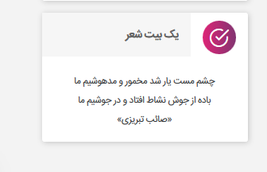
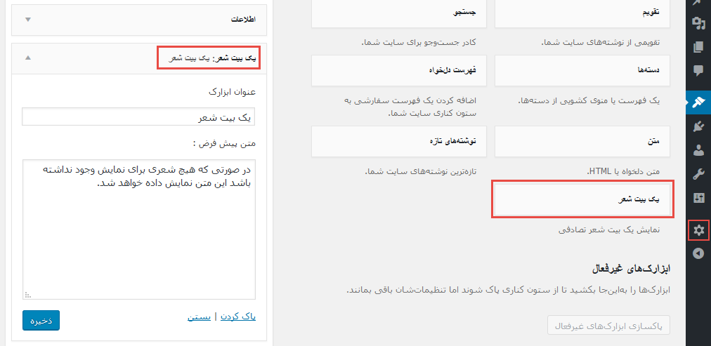

# یک بیت شعر 

افزونه‌ای برای نمایش یک بیت شعر تصادفی در وردپرس

Plugin to display a Distich from Persian poets.

## Requirements
1. [WordPress](https://wordpress.org/)

## امکانات افزونه
1. امکان نمایش یک بیت شعر تصادفی در ویجت
1. امکان نمایش بیت با کد کوتاه در هر جای سایت
1. تغییر بیت در هر بار مرور

## روش استفاده
1. نمایش یک بیت شعر با استفاده از ابزارک
1. نمایش یک بیت شعر با استفاده از کد کوتاه `[yek_beyt]`

## عکس‌ها

### About
* Author: Javad Ahshamian
* Author URI: https://ham3da.ir/